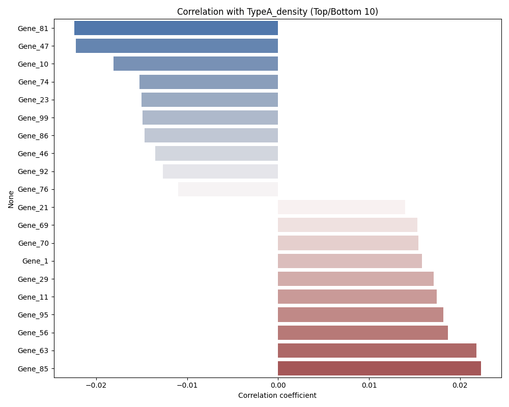
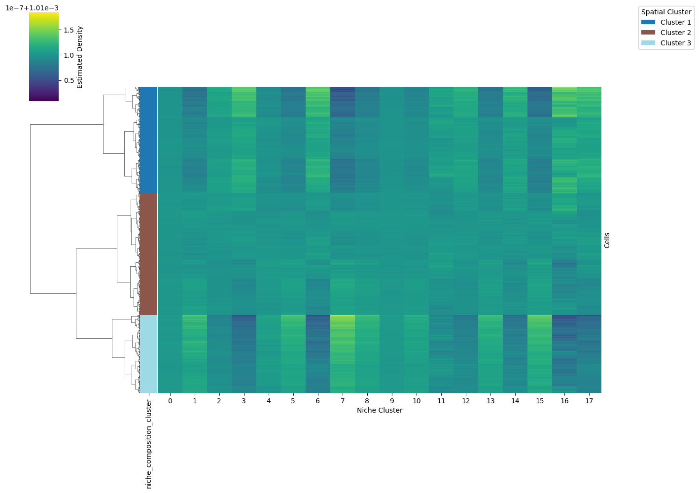

# Getting Started

This tutorial demonstrates the complete workflow of the `mievformer` package for microenvironmental analysis.

## 1. Setup and Data Loading

First, we load the necessary libraries and the dataset. We will use a subsampled version of the lung dataset for this tutorial.


```python
import mievformer as mf
import scanpy as sc
import numpy as np
import os

# Path to the original data
original_data_path = "nichedynamics/data/20230629__230629pre/output-XETG00057__0003908__lung__20230629__073037/adata.h5ad"

# Load data
if os.path.exists(original_data_path):
    adata = sc.read_h5ad(original_data_path)
    print(f"Loaded data with {adata.shape[0]} cells and {adata.shape[1]} genes.")

    # Subsample to 10k cells for tutorial
    if adata.shape[0] > 10000:
        sc.pp.subsample(adata, n_obs=10000)
        print(f"Subsampled to {adata.shape[0]} cells.")
else:
    print(f"Data file not found at {original_data_path}. Please check the path.")
    # Create dummy data for testing if file not found
    adata = sc.AnnData(np.random.rand(10000, 100))
    adata.obsm['spatial'] = np.random.rand(10000, 2)
    adata.obsm['X_pca'] = np.random.rand(10000, 20)
    adata.obs['cell_type'] = np.random.choice(['TypeA', 'TypeB', 'TypeC'], 10000)
    print("Created dummy data.")

```

## 2. Optimize Mievformer Model

We optimize the Mievformer model to learn the niche representation. This step involves training a model to reconstruct the cellular neighborhood.


```python
# Define model path
model_path = "tutorial_model.pth"

# Optimize model
# We use a small number of epochs for demonstration purposes
adata = mf.optimize_nicheformer(
    adata,
    model_path=model_path,
    max_epochs=10,  # Increase for real analysis
    batch_size=128,
    latent_dim=20,
    neighbor_num=100
)

print("Optimization complete.")
print("Added keys to adata.obsm:", adata.obsm.keys())
```

## 3. Calculate wb_ez

Calculate the weight and bias terms for the embedding. This step is required before calculating spatial distribution.


```python
# Calculate wb_ez (required for spatial distribution)
adata = mf.calculate_wb_ez(adata, model_path)
print("Embedding 'e' shape:", adata.obsm['e'].shape)
print("Weights 'w_z' shape:", adata.obsm['w_z'].shape)
```

## 4. Spatial Distribution and Aggregation

Calculate the spatial distribution of cells and aggregate the embeddings.


```python
# Calculate spatial distribution
adata = mf.calculate_spatial_distribution(adata)

# Aggregate distribution embedding
adata = mf.aggregate_dist_e(adata)
print("Spatial distribution calculated.")
```

## 5. Estimate Population Density

Estimate the density of specific cell populations.


```python
# Check available cell types
print(adata.obs['cell_type'].unique())

# Estimate density for a specific group (e.g., the first one found)
target_group = adata.obs['cell_type'].unique()[0]
print(f"Estimating density for: {target_group}")

adata = mf.estimate_population_density(adata, group=target_group, cluster_key='cell_type')

print(f"Density estimated. Added '{target_group}_density' to adata.obs.")
```

## 6. Analyze Density Correlation

Analyze the correlation between the estimated density and gene expression.


```python
density_col = f'{target_group}_density'
output_plot = "density_correlation.png"

corrs = mf.analyze_density_correlation(
    adata,
    density_col=density_col,
    file_path=output_plot
)

print("Top 5 correlated genes:")
print(corrs.nlargest(5))

# Display the plot
# from IPython.display import Image
# if os.path.exists(output_plot):
#     display(Image(filename=output_plot))

# In the documentation build, we display the pre-generated image:
```



## 7. Analyze Niche Composition

Cluster niches based on their cell type composition and visualize the result.


```python
# Analyze niche composition
# This function clusters the niches (e.g., 'leiden_e') based on the composition of cell types within them.
# It also generates a clustermap visualization.

# Ensure we have the necessary keys. 'leiden_e' is usually added by optimize_nicheformer or subsequent clustering.
# If not present, we might need to run clustering on 'e' or 'dist_e'.
if 'leiden_e' not in adata.obs:
    print("Running Leiden clustering on 'e' embedding...")
    sc.pp.neighbors(adata, use_rep='e')
    sc.tl.leiden(adata, key_added='leiden_e')

adata = mf.analyze_niche_composition(
    adata,
    n_clusters=3, # Number of meta-clusters for niches
    file_path='niche_composition_clustermap.png'
)

print("Niche composition analysis complete.")
print("Added 'niche_cluster' to obs:", 'niche_cluster' in adata.obs)

# Display the plot
# from IPython.display import Image
# if os.path.exists('niche_composition_clustermap.png'):
#     display(Image(filename='niche_composition_clustermap.png'))
```



## Summary

In this tutorial, we covered the complete Mievformer workflow:

1. **Data Loading**: Load and preprocess spatial transcriptomics data
2. **Model Training**: Use `optimize_nicheformer` to learn microenvironmental embeddings
3. **Embedding Calculation**: Use `calculate_wb_ez` to compute weight and bias terms
4. **Spatial Distribution**: Use `calculate_spatial_distribution` and `aggregate_dist_e` for distribution analysis
5. **Density Estimation**: Use `estimate_population_density` to estimate cell population density
6. **Correlation Analysis**: Use `analyze_density_correlation` to find correlated genes
7. **Niche Composition**: Use `analyze_niche_composition` to cluster and visualize niches

For more details on each function, see the [API Reference](../api.rst).
